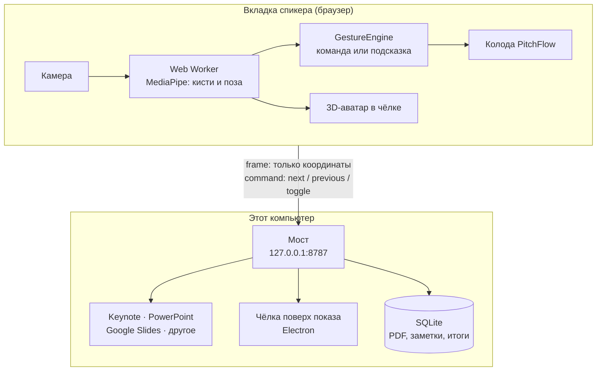
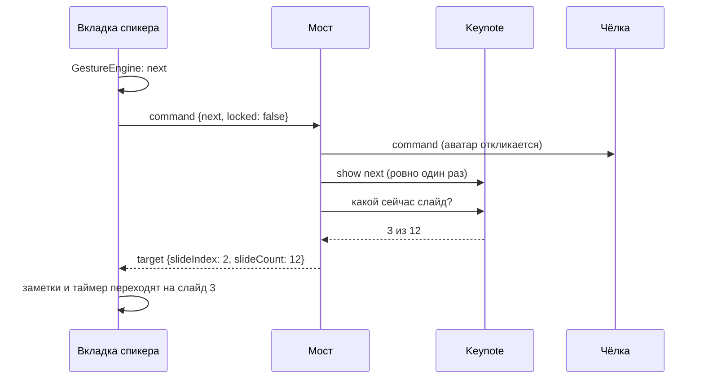

<div align="center">

# PitchFlow

**Листай слайды жестом. Чёрная чёлка с синим 3D-аватаром — твой пульт.**

Веб-помощник для презентаций, питчей, лекций и репетиций. Камера ноутбука
видит ладонь, а аватар в чёлке повторяет твои движения и коротким синим
импульсом подтверждает команду.

       

[Быстрый старт](#-быстрый-старт) · [Жесты](#-жесты) · [Keynote и PowerPoint](#-keynote-powerpoint-и-google-slides) · [Как это устроено](#-как-это-устроено) · [Проверка](#-проверка)

</div>

> Репозиторий, пакет и часть интерфейса пока называются **AxiomPitch**.
> PitchFlow — имя продукта. Это хакатонный MVP.

---

В этой ветке перенесён интерфейс из AxiomPitch-design поверх локального моста.
Главная страница — лендинг, рабочее пространство — `/studio`, обучение — `/learn`.
[Что перенесено и что ещё требует дизайна](docs/design-integration.md).

## ✋ Зачем это

Ноутбук далеко, кликер потерялся, а мысль не должна прерываться. PitchFlow
превращает веб-камеру в пульт:

- **ладонь вправо** — следующий слайд;
- **ладонь влево** — предыдущий;
- **ладонь неподвижно 1,5 секунды** — блокировка, чтобы свободно
  жестикулировать и ничего не переключить случайно.

Если жест не получился, PitchFlow говорит, что именно поправить:
«Раскрой ладонь», «Веди руку горизонтально», «Отведи руку от края кадра».

## ✨ Возможности

<table>
<tr>
<td width="50%" valign="top">

**Жесты и аватар**

- 3D-аватар на Three.js: голова, глаза, улыбка, ладони с пятью пальцами
- Голова и кисти поворачиваются в 3D по точкам MediaPipe
- Распознавание в Web Worker, интерфейс не тормозит
- Калибровка кадра и обучение трём жестам
- Защита от повторных срабатываний
- Режим «ошибка» с конкретными подсказками

</td>
<td width="50%" valign="top">

**Выступление**

- PDF до 30 МБ и 60 страниц или демо-презентация
- Заметки спикера, текущий и следующий слайд
- Окно аудитории без камеры и подсказок
- Таймер, лимит времени, пауза
- Итоги: время по слайдам, команды, подсказки, экспорт JSON
- История последних 10 выступлений

</td>
</tr>
<tr>
<td width="50%" valign="top">

**Мост (по желанию, macOS)**

- Жест листает Keynote, PowerPoint, Google Slides в Chrome
  или любое приложение стрелками
- Чёлка с аватаром висит поверх полноэкранного показа
  на экране аудитории

</td>
<td width="50%" valign="top">

**Данные**

- Без сервера всё работает прямо в браузере
- С мостом PDF, заметки и итоги сохраняются в SQLite
  на этом же компьютере
- Видео с камеры не покидает браузер никогда

</td>
</tr>
</table>

## 🚀 Быстрый старт

Нужны Node.js 22.12+ и npm. Лучше всего работает свежий Chrome или Edge
(WebGL, OffscreenCanvas, Web Workers).

```bash
git clone https://github.com/emil2ka/AxiomPitch.git
cd AxiomPitch
npm ci        # заодно скачает модели MediaPipe в public/vision/
npm run dev
```

Открой <http://localhost:5173>: лендинг ведёт через демо-регистрацию в обучение.
Для прямого входа в студию используй `/studio`. Камере нужен localhost или HTTPS.

Для студии с настоящей чёлкой на Mac запусти **`npm run studio`**: одна команда открывает Vite, локальный мост и Electron. Если эти процессы уже запущены отдельно, сначала заверши их. Один `npm run dev` запускает только сайт. В студии кнопка «Проверка» проверяет камеру, оба свайпа, блокировку и чёлку без истории и переключения настоящей презентации.

> [!NOTE]
> Для первой установки нужен интернет: `postinstall` копирует WASM
> MediaPipe и загружает две модели Google. Если загрузка прервалась,
> запусти `npm run setup:vision`.

## 🎤 Сценарий выступления

1. **Колода.** Оставь демо или нажми «Загрузить PDF».
2. **Камера.** При желании пройди отдельное обучение `/learn`, затем
   включи камеру в студии. Для команд достаточно видимой открытой ладони.
3. **Экран аудитории.** «Экран аудитории» открывает отдельное окно со
   слайдами. Перенеси его на второй монитор и включи полный экран.
   Браузер должен разрешать всплывающие окна.
4. **Старт.** Выбери режим («Репетиция» или «Выступление») и лимит,
   нажми «Начать выступление».
5. **Говори.** Листай жестами. Хочешь свободно жестикулировать — удержи
   ладонь, и команды заблокируются. Повторное удержание их включит.
6. **Итоги.** «Завершить» покажет время по слайдам, число команд и
   подсказок. Итоги можно скачать и открыть позже в истории.

Стрелки ← → на клавиатуре и кнопки под слайдом всегда работают как запасной
вариант.

## Профиль, навигация и подготовка

Профиль локальный: имя обязательно, почта необязательна, пароль и облачная
авторизация не используются. Выход завершает вход и сохраняет профиль.
На странице входа можно выбрать ранее созданный профиль или создать другой.
Профили разделяют историю, настройки и рабочую презентацию; это удобство
на одном устройстве, а не защита доступа к данным браузера.

В студии постоянная навигация: **Студия · История · Обучение · Настройки**.
Имя/аватар открывает страницу профиля, где можно изменить данные и выйти.
Обучение необязательно; при первом входе оно предлагается в студии.
Настройки имеют собственные адреса, например
`/studio?view=settings&section=companion`; кнопки браузера назад/вперёд
восстанавливают раздел без сброса сессии.

«Перед выходом» показывает презентацию, камеру и состояние компаньона.
В «Настроить показ» находятся загрузка PDF и подключение внешнего приложения.
В настройках — выбор камеры, проверка жестов и размах, компаньон, диагностика.
Презентация, заметки и последний локальный слайд сохраняются в IndexedDB;
история и предпочтения — в localStorage отдельно для каждого профиля.
Старый профиль получает прежние историю и предпочтения. С работающим мостом
SQLite связывает PDF, заметки, результаты, настройки и текущую презентацию
с ID профиля. Выход данные не удаляет. Для старого PDF, сохранённого только
в браузере, нужна повторная загрузка оригинала для копии в базе.

«Тест» — отдельная страница с демо-презентацией для камеры, жестов и чёлки.
Он не пишет историю и не меняет рабочую презентацию. «Начать» открывает
отдельный экран выступления на весь экран; возврат в студию ставит сессию
на паузу. Камера и подключение внешнего приложения остаются в студии.

Чёлка имеет три размера
и выбор экрана. Подготовка базы к Supabase: [план переноса](docs/database-migration.md).
Технический экспорт: `npm run db:export`.
[Разбор продукта и следующие функции](docs/product-audit.md).

**Компаньон поверх презентации:** автопоказ действует на новые сессии.
«Показать/скрыть сейчас» и крестик меняют видимость текущей сессии,
не меняя предпочтение автопоказа. При выключенном автопоказе можно показать
окно вручную в активной сессии. Завершение, потеря владельца или heartbeat
скрывают окно. Предпросмотр в настройках показывает вид окна внутри студии,
не открывает Electron и не включает камеру.

Во время сессии обучение и выход недоступны. В других разделах видна ссылка
обратно к текущему показу; просмотр старых итогов не сбрасывает текущий таймер.

## 🖐 Жесты

| Движение                                      | Действие                   |
| --------------------------------------------- | -------------------------- |
| Показать открытую ладонь, провести вправо     | Следующий слайд            |
| Показать открытую ладонь, провести влево      | Предыдущий слайд           |
| Поднять открытую ладонь и держать 1,5 секунды | Блокировка / разблокировка |

- Направления совпадают с зеркальным изображением камеры.
- Свайп — движение примерно на две длины ладони меньше чем за секунду.
  Медленно плывущая ладонь командой не считается.
- После свайпа руку можно спокойно вернуть в центр — это не команда, даже
  если ладонь уходила за край кадра или замирала у конца движения. Чтобы
  вернуться на слайд назад, проведи влево дальше точки, откуда начинал.
- Удержание блокирует жесты, только если после последнего свайпа ты
  опускал руку или расслаблял пальцы. Пауза с поднятой рукой после свайпа
  ничего не заблокирует — PitchFlow подскажет, как это сделать.
- После удержания расслабь пальцы или немного опусти ладонь для повторного взвода.
- Опущенные руки и обычная жестикуляция не считаются ошибками и не
  попадают в итоги.
- Смазанный кадр или короткая потеря руки посреди свайпа его не ломают.
- Длина свайпа считается одинаково на камерах 16:9 и 4:3.
- Команду подаёт ладонь пальцами вверх (допустим наклон до 65°). Ладони
  вверх или боком, как при обычной речи, слайды не листают — PitchFlow
  подскажет «Поверни ладонь пальцами вверх».
- Управляет рука, которую показывают камере: расслабленная вторая рука
  не мешает, а маленькие ладони зрителей на заднем плане не перехватывают
  управление и не вызывают подсказок.
- Ползунок «Размах жеста» меняет длину движения относительно размера ладони.

### Режим «ошибка» — обязательный твист

Своя логика поверх точек MediaPipe проверяет открытость ладони,
траекторию, размах относительно размера руки, время удержания, повторный взвод
и паузу между командами. Вместо «не распознано» спикер видит конкретную
подсказку:

| Что пошло не так                      | Подсказка                                                |
| ------------------------------------- | -------------------------------------------------------- |
| Свайп с двумя согнутыми пальцами      | «Раскрой ладонь: выпрями четыре пальца»                  |
| Быстрое, но слишком короткое движение | «Проведи рукой дальше вправо за одно движение»           |
| Рука идёт по диагонали (49–65°)       | «Веди руку горизонтально, на одной высоте»               |
| Ладонь у края кадра                   | «Отведи руку от края кадра, чтобы вся ладонь была видна» |
| Ладонь пропала посреди свайпа         | «Держи ладонь целиком в кадре до конца движения»         |
| Ладонь слишком маленькая в кадре      | «Ладонь слишком далеко — подойди ближе к камере»         |

Одна и та же подсказка не повторяется чаще раза в 1,2 секунды и попадает
в итоги с ограничением частоты. В режиме
«Выступление» постоянные статусы сокращены, но подсказки всегда видны
на экране спикера.

## 🖥 Keynote, PowerPoint и Google Slides

Хочешь показывать не из PitchFlow, а из привычного приложения? Запусти
локальный мост. Жест по-прежнему распознаёт браузер, а мост нажимает
«дальше» в нужном приложении и поднимает чёлку с аватаром поверх показа.

|                      | Только браузер              | Браузер + мост (macOS)                                   |
| -------------------- | --------------------------- | -------------------------------------------------------- |
| Что запустить        | `npm run dev`               | `npm run server`, `npm run dev`, `npm run overlay`       |
| Где листаются слайды | колода PitchFlow (PDF/демо) | ещё Keynote, PowerPoint, Google Slides, любое приложение |
| Что видит аудитория  | окно «Экран аудитории»      | то же окно или само приложение, чёлка поверх             |
| Где хранятся итоги   | localStorage                | localStorage и SQLite в `server/data/`                   |

### Запуск

```bash
cp .env.example .env.local   # VITE_API_BASE_URL=http://127.0.0.1:8787

npm run server               # терминал 1: мост на 127.0.0.1:8787
npm run dev                  # терминал 2: вкладка спикера
npm run overlay              # терминал 3: Electron-чёлка
```

Дальше во вкладке спикера:

1. В блоке **«Где листать слайды»** выбери приложение и нажми
   **«Подключить»**. Для «Другого приложения» выбери ещё и процесс.
2. Запусти показ в этом приложении на экране аудитории.
3. В студии начни выступление: чёлка появится под физическим вырезом MacBook
   без зазора. В **«Настройках»** можно выбрать другой экран или отключить её.
   Крестик скрывает чёлку до следующего выступления; управление продолжает работать.
4. PDF-превью необязательно. После загрузки подтверди, что PDF соответствует
   внешней презентации. Внешний номер и время по слайдам независимы от длины PDF.
   Для Chrome можно задать начальный номер; он остаётся оценочным.

| Цель                   | Как листает                               | Номер слайда          |
| ---------------------- | ----------------------------------------- | --------------------- |
| PitchFlow              | колода самой вкладки                      | точный                |
| Keynote                | AppleScript `show next` / `show previous` | точный, из Keynote    |
| PowerPoint             | AppleScript, активный показ слайдов       | точный, из PowerPoint |
| Google Slides в Chrome | стрелка, только когда Chrome впереди      | оценка, помечена «≈»  |
| Другое приложение      | стрелка в явно подключённый процесс       | оценка, помечена «≈»  |

> [!IMPORTANT]
> macOS спросит разрешения для терминала, где запущен мост:
> **Автоматизация** — для Keynote и PowerPoint, **Универсальный доступ** —
> для Chrome и «Другого приложения». Без них мост не листает и прямо
> пишет, какое разрешение включить.

> [!TIP]
> В Chrome и Edge камера читается прямо из видеопотока, поэтому жесты
> работают, даже когда вкладка PitchFlow свёрнута или закрыта полноэкранным
> Keynote на том же экране. В других браузерах оставь вкладку видимой:
> там скрытая вкладка останавливает камеру.

Правила безопасности моста:

- удержание ладони — только блокировка, в приложение оно не уходит;
- пока жесты заблокированы, слайд в приложении не двигается;
- стрелка не отправляется, если впереди Terminal, Finder, окно чёлки,
  вкладка PitchFlow или не то приложение, что подключено;
- если показ в Keynote не запущен, будет честное «Не запущен показ
  слайдов в Keynote», а не тихий успех.

API, сообщения WebSocket и все ответы сервера описаны
в [server/README.md](server/README.md).

## 🧭 Как это устроено



<details>
<summary><b>Что происходит, когда ты ведёшь ладонью вправо</b></summary>



Если приложение не сообщает номер (Google Slides, стрелки), мост
присылает `slideIndex: null`. Вкладка сдвигается на шаг сама и ставит «≈»
у номера, чтобы оценка не выглядела точным номером слайда.

</details>

Главные принципы:

- **Жест решает только браузер.** Сервер не видит кадров и не
  распознаёт руки.
- **Видео никуда не уходит.** Мосту и чёлке достаются только координаты
  позы, команды и состояние сессии. Второго захвата камеры нет: окно
  чёлки отклоняет запрос камеры.
- **Без сервера ничего не ломается.** Нет моста — PDF читается локально,
  итоги пишутся в localStorage, колода листается как раньше.

Подробнее: [архитектура](docs/architecture.md) ·
[контракт бека](docs/backend-contract.md) ·
[мост и API](server/README.md).

## 🧰 Команды

| Команда                | Что делает                                                          |
| ---------------------- | ------------------------------------------------------------------- |
| `npm run dev`          | Vite на `localhost:5173`                                            |
| `npm run build`        | модели, проверка TypeScript (фронт, мост, Electron), сборка `dist/` |
| `npm run preview`      | собранная версия на `localhost:4173`                                |
| `npm run server`       | мост на `127.0.0.1:8787`                                            |
| `npm run studio`       | Сайт, локальный мост и чёлка одним запуском                          |
| `npm run overlay`      | Electron-окно чёлки                                                 |
| `npm test`             | 109 тестов на `node:test`, без камеры и без Keynote                  |
| `npm run lint`         | oxlint                                                              |
| `npm run setup:vision` | заново подготовить модели и WASM MediaPipe                          |

<details>
<summary><b>Переменные окружения</b></summary>

| Переменная           | Где      | По умолчанию            | Зачем                                 |
| -------------------- | -------- | ----------------------- | ------------------------------------- |
| `VITE_API_BASE_URL`  | фронт    | пусто (без моста)       | адрес моста для вкладки спикера       |
| `PITCHFLOW_PORT`     | мост     | `8787`                  | порт моста (слушает только 127.0.0.1) |
| `PITCHFLOW_DATA_DIR` | мост     | `server/data`           | где лежат SQLite и PDF                |
| `PITCHFLOW_ORIGIN`   | Electron | `http://localhost:5173` | откуда грузить страницу чёлки         |
| `PITCHFLOW_BRIDGE`   | Electron | `http://127.0.0.1:8787` | где мост                              |

</details>

Для размещения без моста хватит статического HTTPS-хостинга каталога
`dist/`. Не удаляй `dist/vision/`: там локальные модели и WASM.

## 📁 Структура

```text
src/
  components/   чёлка, слайды, экран аудитории, страница чёлки (?overlay=1)
  hooks/        камера и жизненный цикл ресурсов
  lib/          3D-сцена, жесты, PDF, учёт времени, клиенты API и моста
  workers/      обработка кадров MediaPipe
server/src/
  bridge/       цели: pitchflow, keynote, powerpoint, chrome, frontmost
  routes/       презентации, сессии, управление и чёлка
  ws.ts         WebSocket /live
  db.ts, pdf.ts SQLite и проверка PDF
overlay/        Electron-окно чёлки поверх экрана аудитории
scripts/        подготовка моделей и WASM
tests/          жесты, время, аватар, сервер и мост
docs/           архитектура и контракт бека
```

**Стек:** React 19, TypeScript, Vite, Tailwind CSS, MediaPipe Tasks Vision,
Three.js, Motion, PDF.js, Lucide React. Мост: Node.js (`node:sqlite`, `ws`),
Electron 44.

## 🔒 Данные и приватность

- Кадры камеры обрабатываются только в браузере и никуда не отправляются.
  Сегментация отключена: аватару нужны только координаты, без пиксельной
  маски человека.
- Без моста PDF, заметки и история живут только в браузере. Очистка
  данных браузера удалит историю.
- С мостом копия PDF, заметки и итоги лежат в `server/data/` на этом
  компьютере. Папка не попадает в git.
- Мост слушает только `127.0.0.1`, принимает запросы лишь от страниц
  Vite и preview и работает **без авторизации**: это доверенный локальный
  процесс на время хакатона. Не открывай его порт в сеть.

## ✅ Проверка

**Автотесты — 109, все зелёные** (`npm test`, без веб-камеры):

- направления команд, удержание, блокировка и разблокировка, повторный
  взвод, опущенные руки, конкретные подсказки, потеря отслеживания;
- учёт времени без пауз, повороты головы и кистей, устойчивость
  к некорректным точкам;
- мост: отклонение не-PDF, файлов больше 30 МБ и длиннее 60 страниц,
  проверка итогов сессии, фейковая цель получает `next`/`previous` ровно
  по одному разу, `toggle` и блокировка не листают, стрелка не уходит
  чужому процессу, неизвестный номер слайда не выдаётся за настоящий.

<details>
<summary><b>Что проверено руками</b></summary>

В браузере: PDF с кириллицей, окно аудитории, пауза, завершение и история,
запуск обеих моделей в Worker, аватар до включения камеры, отслеживание
по контрольному видеопотоку, блокировка и возврат в спокойную позу, нет
ошибок JavaScript и горизонтального переполнения на телефоне.

Мост — на MacBook без Keynote и PowerPoint:

- Сценарий «вправо → влево → удержание → шаг при блокировке → удержание»
  прошёл на цели PitchFlow и на фейковой цели Keynote. Вместо камеры
  подставлялись заранее записанные точки кисти. При блокировке шаг
  до приложения не дошёл.
- «Завершить» сохраняет сессию, `GET /api/sessions` отдаёт режим,
  длительность, время по слайдам, команды и подсказки.
- Чёлка осталась на экране, пока другое приложение было в полноэкранном
  Space (проверено по списку окон macOS). Страница чёлки рисует аватар
  и получает позу и замок.

**Не проверено руками:** AppleScript для Keynote и PowerPoint (их нет на
тестовой машине) и реальная отправка стрелки в Chrome (нет разрешения
«Универсальный доступ»). Финальную проверку жестов стоит сделать на камере
выступающего, с его светом и расстоянием.

</details>

## ⚠️ Ограничения

- Обычную жестикуляцию нельзя идеально отличить от команды по намерению
  человека. Поэтому для свободной жестикуляции предусмотрена блокировка,
  а для свободной речи есть блокировка.
- Управление Keynote, PowerPoint и другими приложениями — только на macOS.
  Zoom и другие программы не управляются.
- Не оцениваются эмоции, уверенность, качество речи и содержание питча.
  Поворот головы оценивается приблизительно, глаза аватара — анимация,
  а не распознавание взгляда.

## 📜 Происхождение кода и моделей

Проект создан 28 сентября 2026 после старта хакатона (07:00 UTC+5).
Использован публичный шаблон create-vite React + TypeScript и открытые
библиотеки. Собственные заготовки до старта не переносились. Код жестов,
обратной связи, сессии, моста и интерфейса написан для этого проекта.

Готовые модели:
[Pose Landmarker](https://ai.google.dev/edge/mediapipe/solutions/vision/pose_landmarker)
и [Hand Landmarker](https://ai.google.dev/edge/mediapipe/solutions/vision/hand_landmarker).
Модели и WASM воспроизводимо готовятся скриптом; их бинарники, тестовые
снимки, личные PDF и секреты не входят в репозиторий.
